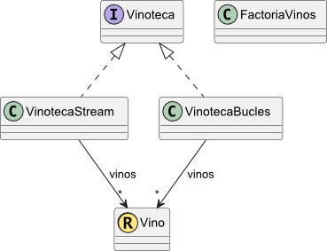

# Fundamentos de Programación
# Ejercicio de laboratorio: Valoraciones vinos

**Autor:** José A. Troyano. 
**Revisores:** Fermín Cruz, Mariano González, Toñi Reina. 
**Última modificación:** 31/03/2025.


**Objetivos:**

- Implementar tratamientos secuenciales con bucles.
- Implementar los primeros tratamientos secuenciales con Stream.


## **1 Material**

Para la realización de esta práctica se dispone de los siguientes elementos:

- **/data/**: carpeta de datos.
  - **/data/wine\_reviews.csv**: fichero CSV con datos de valoraciones de vinos.
- **/src/fp.vinos.test**: paquete Java con las clases de test para las distintas clases que habrá que desarrollar en el proyecto.
- **/src/fp.utiles**: paquete Java con utilidades de la asignatura.
- **/img/**: carpeta con imágenes de los diagramas de clases.
- **/out/**: archivos de texto con el resultado de la ejecución de los tests.
- **README.md**:  Archivo markdown con el enunciado de la práctica. 

## **2 Datos disponibles**

En este proyecto trabajaremos con datos sobre valoraciones de vinos. En estos datos encontramos solo un tipo de entidad:

- **Vino:** contiene la información relativa a la valoración de un determinado vino, con datos sobre la procedencia, precio y puntuación.

Los datos están disponibles en formato CSV. A continuación se muestran las primeras líneas del fichero de datos.
```
Country,Region,Points,Price,Grape
US,California,96,235.0,Cabernet Sauvignon
Spain,Northern Spain,96,110.0,Tinta de Toro
US,California,96,90.0,Sauvignon Blanc
US,Oregon,96,65.0,Pinot Noir
France,Provence,95,66.0,Provence red blend
Spain,Northern Spain,95,73.0,Tinta de Toro
Spain,Northern Spain,95,65.0,Tinta de Toro
```

## **3 Ejercicios**

Para diseñar este proyecto vamos estructurar el código en las clases, interfaces y records que se muestran en la siguiente figura.




### **EJERCICIO 1**

Cree el tipo **Vino**, implementándolo como un ***record*** con las siguientes propiedades::

**Propiedades:**
- **pais:** de tipo *String* con el país del vino. Consultable.
- **region:** de tipo *String* con la región del vino. Consultable.
- **puntos:** de tipo entero con la puntuación obtenida en la valoración, los puntos deben estar entre cero y cien. Consultable.
- **precio:** de tipo *Double* con el precio del vino, el precio debe ser mayor que cero. Consultable.
- **uva:** de tipo *String* con el tipo de uva del vino. Consultable.
- **calidadPrecio:**  de tipo Double. Se calcula como la puntuación dividida por el precio. Consultable.

**Constructor:**
- **C1**: Crea un objeto tomando como parámetros las propiedades básicas del mismo en el orden en el que se describen arriba.

**Representación como cadena:**
- Se muestran todas las propiedades básicas del tipo.

**Criterio de igualdad:**
- Dos objetos de tipo Vino son iguales si todas sus propiedades básicas son iguales.

### **EJERCICIO 2**

Cree el tipo **Vinoteca**, con las siguientes propiedades y operaciones, teniendo en cuenta que debe implementar el tipo mediante una interfaz **Vinoteca** y dos clases distintas, **VinotecaBucles** y **VinotecaStream**, de forma que en la clase **VinotecaBucles** se implementen todas las operaciones relacionadas con los tratamientos secuenciales con bucles, y en la clase **VinotecaStream** se deben implementar con `Streams`.


**Propiedades:**
- **vinos:** de tipo conjunto de **Vino**. No es consultable. Se modifica a partir de las operaciones que se describen más abajo.

**Constructores:**
- **C1:** constructor sin parámetros. Crea un objeto sin vinos.
- **C2:** constructor a partir de una *Collection* de **Vino**. Crea un objeto de tipo **Vinoteca** con los vinos de la colección que se pasa como parámetro.

**Representación como cadena:**
- Muestra el número total de vinos incluidos en el objeto Vinoteca.

**Criterio de igualdad:**
- Dos objetos de tipo **Vinoteca** son iguales si los son los vinos que contienen.

**Otras operaciones:**
- **Vinoteca::agregarVino:** añade un Vino dado como parámetro al objeto de tipo Vinoteca sobre el que se aplica.
- **Vinoteca::eliminarVino:** elimina un vino. Si no existe, eleva `IllegalArgumentException`.
- **Vinoteca::obtenerNumeroVinos:** calcula el número total de vinos.
- **Vinoteca::contieneVino:** devuelve `true` si el contenedor contiene un objeto de tipo Vino dado como parámetro.
- **Vinoteca::agregarVinos:** añade todos los vinos de una colección dada como parámetro al objeto de tipo Vinoteca que lo invoca.
- **Vinoteca::contieneVinos:** devuelve `true` si el contenedor contiene todos los vinos de una colección de vinos dada como parámetro.

### **EJERCICIO 3**

Crear la clase **FactoriaVinos** con los siguientes métodos estáticos:
- **FactoriaVinos::parsearVino:** método privado para construir un objeto **Vino** a partir de una línea CSV del fichero de entrada.
- **FactoriaVinos::leerVinoteca** método que devuelve un objeto **Vinoteca** a partir de la ruta del fichero en el que se encuentran los datos de los vinos.

### **EJERCICIO 4**

#### **Apartado a - Tratamientos secuenciales simples**

- **Vinoteca::calcularNumeroVinosDePais:** cuenta el número de vinos de un país dado como parámetro.
- **Vinoteca::obtenerVinosRangoPuntos:** devuelve una colección de objetos de tipo Vino solo con los vinos que estén valorados en un rango de puntos determinado. El rango vendrá especificado por dos enteros (inf y sup) dados como parámetros. Si el valor del límite inferior del rango es superior al valor del límite superior, se elevará `IllegalArgumentException`.
- **Vinoteca::calcularNumeroVinosDePaisConPuntuacionSuperior:** devuelve el número de vinos del país dado como parámetro que tienen una puntuación superior a un umbral dado como parámetro.
- **Vinoteca::obtenerVinosBaratos:** obtiene un conjunto con los vinos cuyo precio es inferior a uno dado como parámetro.
- **Vinoteca::existeVinoDeUvaEnRegion:** devuelve true si existe en la región dada como parámetro un vino elaborado con la uva dada como parámetro.

#### **Apartado b - Tratamientos secuenciales de acumulación**

- **Vinoteca::calcularUvasDeRegion:** devuelve un conjunto con los nombres de las uvas que se usan en los vinos de una región dada como parámetro
- **Vinoteca::calcularTotalPuntosVinosDeRegion:** devuelve la suma de las puntuaciones de todos los vinos de una región dada como parámetro.
- **Vinoteca::calcularMediaPuntosVinosDeUva**: devuelve la puntuación media de los vinos obtenidos a partir de un tipo de uva dado como parámetro. Si la media no se puede calcular, devuelve cero.

#### **Apartado c - Tratamientos secuenciales con criterios de ordenación**

- **Vinoteca::obtenerVinoMejorPuntuado:** devuelve el objeto de tipo Vino con la puntuación más alta. Si no se puede calcular eleva NoSuchElementException.
- **Vinoteca::obtenerVinoMejorPuntuadoDePais:** devuelve el objeto de tipo Vino con la puntuación más alta de un país dado como parámetro. Si no se puede calcular eleva `NoSuchElementException`.
- **Vinoteca::obtenerNVinosRegionOrdenadosPrecio**: devuelve una lista ordenada con los N vinos más caros de una región dada como parámetro, ordenados del más caro al más barato.

#### **Apartado d - Tratamientos secuenciales con Map**

- **Vinoteca::agruparVinosPorPais:** devuelve un Map que asocia a cada país una lista con los objetos de tipo Vino de ese país. 
- **Vinoteca::agruparUvasPorPais:** devuelve un Map que asocia los países con conjuntos que contienen los nombres de las uvas usadas en los vinos del respectivo país.
- **Vinoteca::calcularCalidadPrecioPorRegionMayorDe:** devuelve un Map que asocia las regiones con el número de vinos cuya relación calidad/precio supera un umbral dado como parámetro.
- **Vinoteca::calcularVinoMasCaroPorPais:** devuelve un Map que asocia a cada país el vino más caro de ese país.
- **Vinoteca::calcularNMejoresVinosPorPais:** devuelve un SortedMap que asocia a cada país los N vinos mejor puntuados de ese país. 
- **Vinoteca::calcularRegionConMejoresVinos:** obtiene la región con mayor número de vinos cuya relación calidad/precio supera un umbral dado como parámetro.
